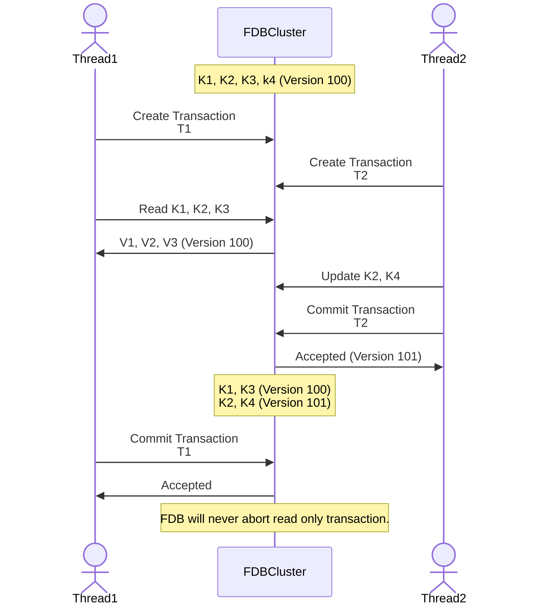

## Task setup
Prerequisite: 4 pairs of key-value existed in the FDB cluster (K1, K2, K3, K4)



## Comment
I think the scenario for this sub-task will not demonstrate the power of snapshot read.
Because T1 is read-only transaction, which will never be aborted.
Therefore, both T1, T2 will not be aborted in this case.

## Execution Log
```
Use cluster file: ../foundationdb/build/fdb.cluster
This program uses client version: 7.3.43,412531b5c97fa84343da94888cc949a4d29e8c29,fdb00b073000000

Network thread started.
Database create successfully.
[INFO] transaction: set_all_kv_pairs committed
[INFO] Auxiliary thread is started.
[DEBUG] Obtained kv pair is matched: key_0:value_000000000000000000000000000000000000000000000000000000000000000000000000000000000000000000000
[DEBUG] Obtained kv pair is matched: key_1:value_000000000000000000000000000000000000000000000000000000000000000000000000000000000000000000001
[DEBUG] Obtained kv pair is matched: key_2:value_000000000000000000000000000000000000000000000000000000000000000000000000000000000000000000002
[DEBUG] key_1 updated
[DEBUG] key_3 updated
[INFO] transaction: update_try_to_cause_conflict committed
[INFO] transaction: read_only_without_snapshot_will_not_be_aborted committed
[DEBUG] Obtained key_0:value_000000000000000000000000000000000000000000000000000000000000000000000000000000000000000000000
[DEBUG] Obtained key_1:updated_0000000000000000000000000000000000000000000000000000000000000000000000000000000000000000001
[DEBUG] Obtained key_2:value_000000000000000000000000000000000000000000000000000000000000000000000000000000000000000000002
[DEBUG] Obtained key_3:updated_0000000000000000000000000000000000000000000000000000000000000000000000000000000000000000003
[INFO] transaction: read_all_for_checking_committed committed
[INFO] transaction: cleanup committed
Network thread stopped.
```
