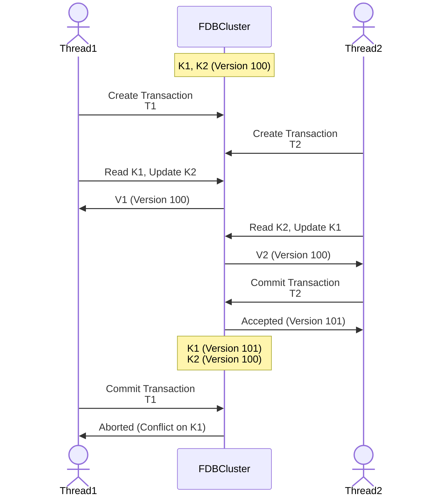

## Task Setup
Prerequisite: 2 pairs of key-value existed in the FDB cluster (K1, K2)



## Comment
T2 will not be aborted because it commits first. However, T1 will be aborted because this transaction read the value that involved in the update operation in the previous committed transaction T2. T1 will only be accepted if snapshot reading for K1 is enabled, because this will not add K1 in the read conflicting set, which will be used by resolvers to check the confliction during the commit phase.

## Execution Log
```
Use cluster file: ../foundationdb/build/fdb.cluster
This program uses client version: 7.3.43,412531b5c97fa84343da94888cc949a4d29e8c29,fdb00b073000000

Network thread started.
Database create successfully.
[INFO] transaction: set_all_kv_pairs committed
[INFO] Try to send txn from auxiliary thread.
[INFO] transaction: read_K2_update_K1 committed
[ERROR] Something wrong in transaction: read_K1_update_K2_should_be_aborted, to rollback... Description: Transaction not committed due to conflict with another transaction
[DEBUG] obtained V1: updated_0000000000000000000000000000000
[DEBUG] obtained V2: value_000000000000000000000000000000001
[INFO] transaction: read_both_for_check committed
[INFO] transaction: cleanup committed
Network thread stopped.
```
